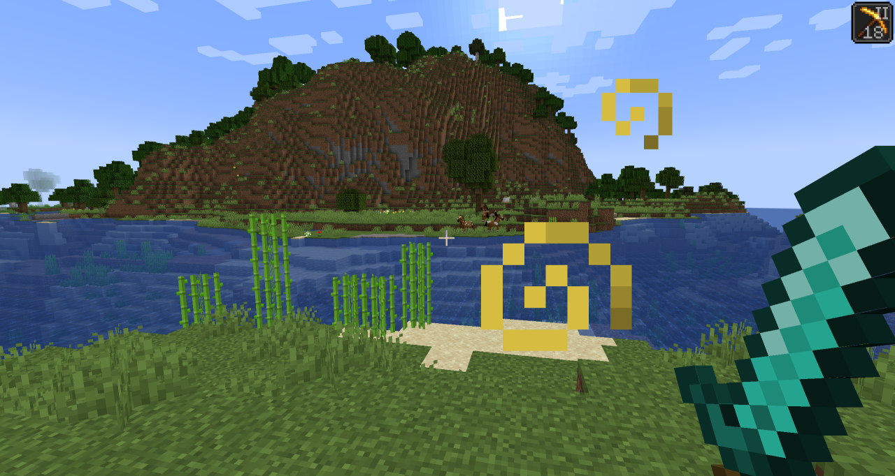

# Auto HUD 

Auto HUD is a Minecraft mod for the Fabric launcher which hides parts of the user
interface (HUD) that are currently not interesting.

It is inspired by similar mods ("immersive hud") for other games.
I personally really like the clean view of no visible HUD, but get frustrated by the
limitations of using F1 mode.

This is an opinionated rewrite of [Head-down Display](https://github.com/jadc/headdowndisplay/) that never got updated.

## Features
* Toggle the whole HUD with a key binding.
* Have parts of the HUD that haven't changed hide away.
* Hide persistent, unchanging status effects, such as water breathing from the turtle helmet.
* Show remaining time of status effects.
* Highly configurable.

### Visual differences to F1 mode
* Player hand / equipped items remain visible
* Player names remain visible
* The vignette remains active
* Incoming chat messages still pop up
* Crosshair remains visible (see my other mod Dynamic Crosshair for that)
* Configurable what elements are hidden

## Screenshots
All HUD elements are hidden except for the currently active status effect:

Possible look with shaders installed:

## Installation
This mod has been written for Fabric for Minecraft 1.18.2.

Get packaged versions from [Modrinth](https://modrinth.com/mod/autohud) or [Curseforge](https://www.curseforge.com/minecraft/mc-mods/auto-hud)!

* requires [Fabric API](https://modrinth.com/mod/fabric-api)
* requires [ClothConfig](https://modrinth.com/mod/cloth-config)
* not required: [Mod Menu](https://modrinth.com/mod/modmenu) for ingame configuration screen

## Mod Compatibility
This mod includes a modified version of magicus' [Status Effect Timers](https://modrinth.com/mod/statuseffecttimer),
because I could not figure out how to dynamically insert my modifications into it.
Since this mod allows for status effect icons to be hidden individually,
the non-modified version will draw the timers in the wrong place.

Known to be compatible:
* [Dynamic Crosshair](https://modrinth.com/mod/dynamiccrosshair) augments this mod by allowing to hide/change the crosshair based on context.
* [Raised](https://modrinth.com/mod/raised) works perfectly.
* [HUDTweaks](https://modrinth.com/mod/hudtweaks) mostly works.
  Vertical status effects bar does not work with the timer overlay.
  Animation direction and offset may have to be tweaked in AutoHud's settings manually.
* [AppleSkin](https://modrinth.com/mod/appleskin) appears to work fine.
* [DetailArmorBar](https://modrinth.com/mod/detail-armor-bar) is supported.
* [BerdinskiyBears Armor Hud](https://www.curseforge.com/minecraft/mc-mods/berdinskiybears-armor-hud) is supported in "hotbar" configuration
* [Dehydration](https://www.curseforge.com/minecraft/mc-mods/dehydration) is supported (hydration bar follows hunger bar settings).
* [Inventory Profiles Next](https://modrinth.com/mod/inventory-profiles-next)' lock symbol is supported.

Known to be incompatible:
* OptiFabric crashes due to mixin conflicts.
* Any other mod that draws status effect timers should have that functionality disabled.
* HUD elements created by other mods will most likely not be moved.
* Bedrockify overwrites the status effect modifications. To get them working, disable the `screenSafeArea` mixin.
